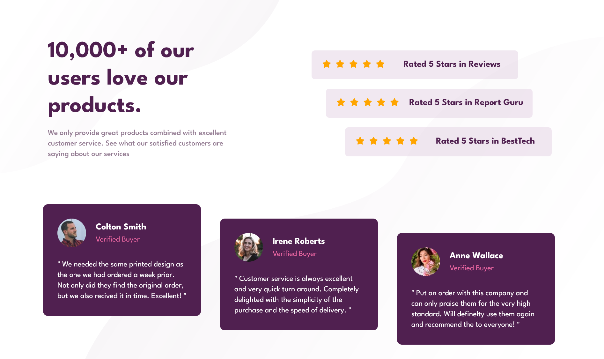

# Frontend Mentor - Social proof section solution

This is a solution to the [Social proof section challenge on Frontend Mentor](https://www.frontendmentor.io/challenges/social-proof-section-6e0qTv_bA). Frontend Mentor challenges help you improve your coding skills by building realistic projects. 

## Table of contents

- [Overview](#overview)
  - [The challenge](#the-challenge)
  - [Screenshot](#screenshot)
  - [Links](#links)
- [My process](#my-process)
  - [Built with](#built-with)
  - [What I learned](#what-i-learned)
  - [Continued development](#continued-development)
- [Author](#author)

## Overview

### The challenge

Users should be able to:

- View the optimal layout for the section depending on their device's screen size

### Screenshot

### Links

- Live Site URL: (https://miluvalverde.github.io/socialProofSection/)

## My process

### Built with

- Semantic HTML5 markup
- CSS custom properties
- Flexbox
- CSS Grid
- Mobile-first workflow
- [Google fonts](https://fonts.google.com/) - For fonts
- [FontAwesome](https://fontawesome.com/) - For icons

### What I learned

In this porject I applied my basic HTML and CSS knowledge such as basic HTML structure, class, id, flex-box, grid, pseudo-class, transition, media queries and sass/scss.

### Continued development

I would like to continue focusing on grid layout, animations and transitions, these are concepts that I'm not 
completely comfortable with.

## Author

- Frontend Mentor - [@miluvalverde](https://www.frontendmentor.io/profile/miluvalverde)
- FreeCodeCamp - [@milu-valverde](https://www.freecodecamp.org/milu-valverde)